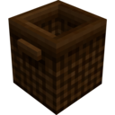
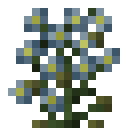
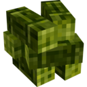

# The Wily Textiles Mod
   

A Minecraft Forge mod centered around the acquisition of textile-like items from alternative sources.

If you're tired of sleepless nights spent mugging Spiders for their string, then this is the mod for you!

## Features
* A **String** analogue, **Twine** and ways to craft it from foraged grasses
* A new crop, **Flax**, whose stalks can be used to create **Twine** or simply raw **Plant Fibers**, and whose blossoms can be used to craft **Dyes**
* A handy **Basket** block, for capturing fallen items
* A way to get more out of **Spider Webs**, by recrafting them into **Silk**
* A way to create **Chainmail Armor** pieces, via **Chain Mesh**
* A way to convert wooden items into other varieties using **Wood Stain** and **Wood Bleach**
* ... And more to come! Maybe! We'll see!

## Attributions and Credits
* Texture assets used with own permission from my other project, [unused-textures](https://github.com/malcolmriley/unused-textures) via CC-BY-4.0.
* Certain **JSON Model Files** were made using [BlockBench](https://blockbench.net); these files are denoted as such by their `credit` field.
* Also, thanks and appreciation to **Minecraft Forge** contributors without whom projects like these would probably not exist.

## License Information
* The image files and JSON model files contained in this repository are licensed under the [Creative Commons Attribution 4.0 International License](https://creativecommons.org/licenses/by/4.0/), as per the [License](LICENSE-CC-BY-4.0) included in the repsository. Many are derived from [unused-textures](https://github.com/malcolmriley/unused-textures) where they are available under the same license.
* All other source code assets original to and contained within this repository are licensed under the [MIT License](https://mit-license.org), as per the [License](LICENSE) included in the repository.
